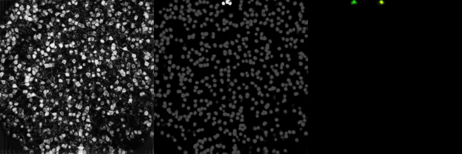
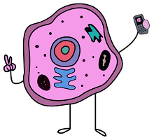
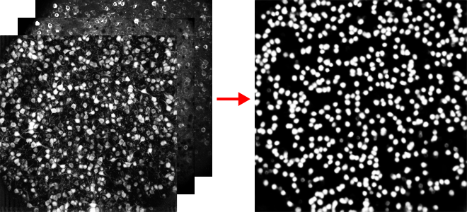
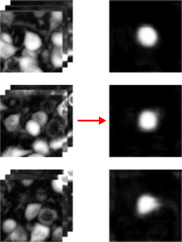

 

# cellfie

`cellfie` (**CELL** **FI** nd **E** r) automatically segments neurons in calcium imaging videos using fully convolutional neural networks.

Neuroscientists use [calcium imaging](https://en.wikipedia.org/wiki/Calcium_imaging) to monitor the activity of large populations of neurons in awake, behaving animals (like in [this](https://www.youtube.com/watch?v=Nxa19uWC_oA) beautiful example). However, calcium imaging can be very noisy, making neuron identification challenging. `cellfie` addresses this problem using a two stage convolutional neural network approach. First, a *region proposal* network identifies potential neurons. Next, an *instance segmentation* network iteratively identifies individual neurons.

`cellfie` is under active development. I'm collaborating with [Eftychios Pnevmatikakis](https://www.simonsfoundation.org/team/eftychios-a-pnevmatikakis/) at the Simon's Foundation to see if neural networks combined with matrix factorization techniques (as used by [CaImAn](https://github.com/flatironinstitute/CaImAn/blob/master/README.md)) outperform current approaches to calcium imaging segmentation. The datasets used to train `cellfie` were meticulously created by Eftychios and his team.
  

#### region proposal

First, a *region proposal* network segments all neurons from the background. Rather than passing enormous videos into the network, three summary images are created that collapse videos across time:

1. *correlation images* that represent the correlation of each pixel to all neighboring pixels. The idea here is that neurons within a cell will be correlated with neighboring within-cell pixels.
2. *standard deviation images* that capture the variability of each pixel. Pixels belonging to neurons should have higher variability due to fluctuations in neural activity.
3. *median images* that are... median images.

I use a [U-Net](https://arxiv.org/abs/1505.04597)-style fully convolutional neural network that turns these summary images into a heatmap where each pixel represents the probability that the pixel belongs to a neuron (depicted above).
  

#### instance segmentation

But how can we find individual neurons? I train a second *instance segmentation* network that takes small subframes within the summary images as input. This network outputs:

1. a segmentation of the neuron centered within the current subframes (omitting other neurons in the frame!)
2. a likelihood that there is a neuron centered at that location
  

#### putting it all together

Putting together the region proposal and instance segmentation networks allows us to find all neurons in a video. First, I find potential neurons by looking for local maxima in the probability map generated by the region proposal network (the middle image above). Next, I pass subframes centered at these maxima to the instance segmentation network, keeping only segmentations with high likelihood scores.
  

#### cellfie philocellphy
*Data regularities are your friend!* Many machine learning algorithms are built to handle data 'in the wild', e.g. images from cell phones or self-driving cars that are enormously variable. Scientific datasets, however, have remarkable stereotypy that can be leveraged when building new algorithms. For example, [Mask R-CNN](https://arxiv.org/abs/1703.06870) uses an array of bounding boxes to handle objects of different sizes. But in microscopy data, we already know how big a cell should be! This makes our job way easier, and our algorithms way faster. For example, `cellfie` uses pretty shallow networks that are trained from scratch (without needing [transfer learning](https://machinelearningmastery.com/transfer-learning-for-deep-learning/)) in only ~ a half hour (on a crummy GPU!). Furthermore, because I know the approximate size of neurons, I only need to run the instance segmentation networks on subframe of a single size, making the algorithm much faster.  

#### notes

* This work is inspired by [DeepMask](https://arxiv.org/abs/1506.06204), which presents a really neat approach to instance segmentation.
* `cellfie` is under active development. If you are interested in trying `cellfie` on your data, please let me know.
* I'm collaborating with [Eftychios Pnevmatikakis](https://www.simonsfoundation.org/team/eftychios-a-pnevmatikakis/) at the Simon's Foundation to see if neural networks combined with matrix factorization techniques (as used by [CaImAn](https://github.com/flatironinstitute/CaImAn/blob/master/README.md)) outperform current approaches to calcium imaging segmentation. The datasets used to train `cellfie` were meticulously created by Eftychios and his team.
  
